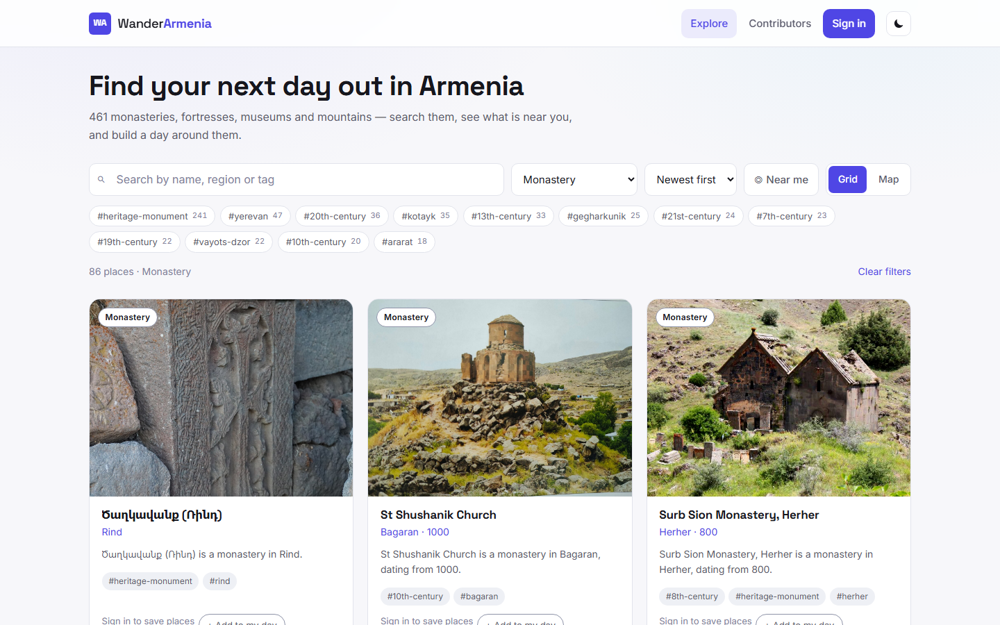
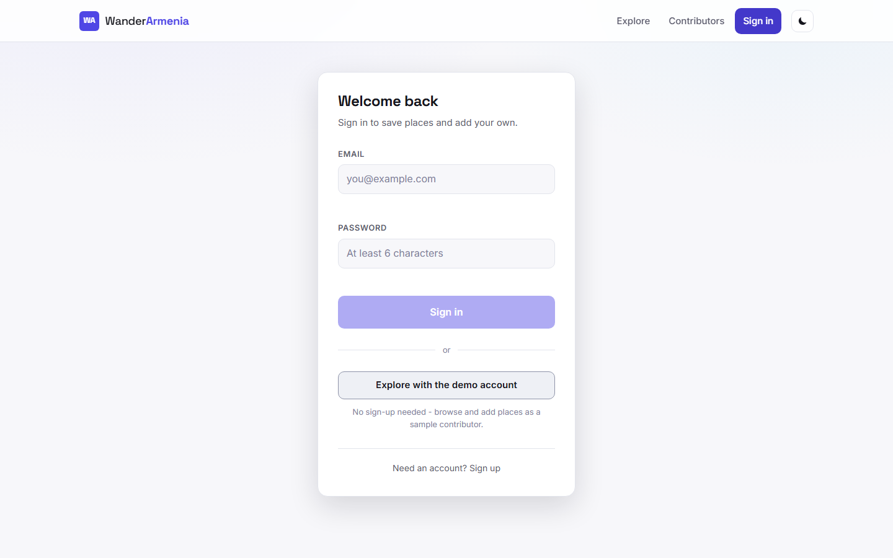

# Wander Armenia

Places worth the drive — the monasteries, fortresses, lakes and mountains you
could reach this weekend. Search them by name, region or category, see what's
near you, save the ones you've been to and the ones you still want to see, and
string a few of them into a day out.

The catalogue is seeded from **Wikidata**, so the content is real: actual
Armenian places with their actual provinces and dates, photographed by Wikimedia
Commons contributors.

**Live:** https://wanderarmenia.vercel.app · **API:** https://wanderarmenia-api.vercel.app
· **Demo login:** `demo@wanderarmenia.demo` / `demo1234`


<table>
<tr>
<td width="50%"></td>
<td width="50%"></td>
</tr>
<tr>
<td>Filtering by tag and category, with live counts on every option</td>
<td>Sign in, sign up, or use the one-click demo account</td>
</tr>
</table>

---

## Run it locally

No database, no accounts, no configuration:

```bash
npm run setup     # installs root, api and web dependencies
npm run dev:demo  # starts both, with a throwaway in-memory database
```

Then open <http://localhost:3000>. The API runs on port 5000.

`dev:demo` boots an in-memory MongoDB replica set, seeds it with the bundled
catalogue of 461 places, and throws it all away on exit — so anyone can clone
this repo and see the working app in one command.

To run against a real database instead, copy `api/.env.example` to `api/.env`,
fill it in, then:

```bash
npm run seed      # optional demo content
npm run dev
```

| Script | What it does |
| --- | --- |
| `npm run setup` | Install dependencies for root, `api/` and `web/` |
| `npm run dev` | Both servers, API against the database in `api/.env` |
| `npm run dev:demo` | Both servers, API against a throwaway in-memory database |
| `npm run build` | Production build of the web app |
| `npm run seed` | Load the bundled catalogue into the configured database |
| `npm run start:api` | Run the API alone as a long-lived process |
| `npm run fetch:places` | Re-download the catalogue from Wikidata (rarely needed) |

---

## What's in it

- **Real catalogue data** — 461 places imported from Wikidata's SPARQL endpoint
  and normalised into the app's schema, each linking back to its source record.
  Cached in the repo (`api/scripts/places.json`) so seeding is deterministic and
  needs no network.
- **Explore feed** — search by title, region, description or tag; filter by tag
  and category with live counts; sort and paginate. Filter state lives in the
  URL, so any view is linkable and the back button works.
- **Near me** — `?near=lat,lng&radius=km` sorts by real distance and reports it,
  answered by a `2dsphere` index in the database rather than by measuring every
  document in JavaScript.
- **Map view** — every result plotted on a Leaflet basemap, auto-fitted.
- **Personal lists** — a signed-in visitor keeps a **visited** and a **wishlist**
  list. Saving to one removes it from the other, because somewhere you have been
  is no longer somewhere you want to go.
- **Day planner** — pick a few stops and the browser orders them nearest-first,
  estimates distance and time, and hands off to a Google Maps directions link.
  Straight-line maths, no routing service, no API key — and the UI says so.
- **Contribute** — drag-and-drop photo upload, and the API geocodes the address
  you type onto the map.
- **Accounts** — JWT auth, plus a one-click demo login so nobody has to sign up
  to look around.
- **Honest loading states** — the API sleeps on free hosting, so the app probes
  it, explains the wait, and shows skeletons instead of an error dialog.

## Stack

**API** — Node · Express · MongoDB (Mongoose) · JWT · Cloudinary · Nominatim
**Web** — React 18 · Vite · React Router 7 · Sass · Leaflet

## Layout

```
api/    Express REST API      → api/README.md · api/NOTES.md
web/    React app             → web/README.md · web/NOTES.md
```

Each half keeps its own `package.json` and dependencies, so they still deploy
independently. The root package only wires them together for development.

> **Why not npm workspaces?** For two apps that share no code, `concurrently`
> plus per-folder installs does the same job with fewer moving parts and no
> dependency-hoisting surprises. Workspaces would earn their keep the moment
> there's a shared package worth extracting.

## Design notes

Both halves have a `NOTES.md` explaining the decisions that aren't obvious from
the code — why writes use a transaction, why coordinates are stored as GeoJSON,
why the JWT lives where it does, why the search can't use an index, why some
validation is deliberately duplicated between client and server.

- [api/NOTES.md](api/NOTES.md)
- [web/NOTES.md](web/NOTES.md)

## Deployment

The two halves deploy separately from this one repo:

- **API → Vercel.** Set the project's *Root Directory* to `api`. It runs as a
  single serverless function (`api/api/index.js`) with a cached Mongoose
  connection. Environment variables are listed in `api/.env.example`.
- **Web → Vercel.** Set the project's *Root Directory* to `web`. It builds with
  Vite and deploys automatically on every push to `main`. `VITE_API_URL` lives in
  `web/.env.production`.

The project's first home, `mern-project-front.web.app`, now serves a 301 redirect
to the Vercel deployment so older links still work. That redirect is a one-off
Firebase Hosting release; there is deliberately no Firebase configuration left in
this repository.

## History

This started as a two-repo practice project following a course, was rebuilt into
an atlas of public art, and is now Wander Armenia. Both original repositories'
commit histories are preserved here — `git log --follow api/app.js` and
`git log web/src/index.jsx` both reach back to January 2024.
