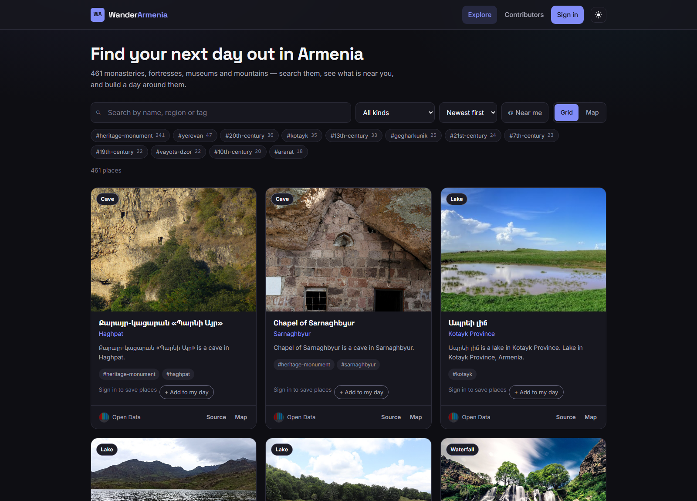

# StreetCanvas

An atlas of public art — the sculptures, murals, monuments and fountains you walk
past every day. Search them by artist, city or material, see them on a map, and
add the ones you find yourself.

The catalogue is seeded from **Wikidata**, so the content is real: actual
artworks with their actual sculptors, dates and materials, photographed by
Wikimedia Commons contributors.

**Live demo:** https://streetcanvas.vercel.app · **Demo login:** `demo@streetcanvas.demo` / `demo1234`



---

## Run it locally

No database, no accounts, no configuration:

```bash
npm run setup     # installs root, api and web dependencies
npm run dev:demo  # starts both, with a throwaway in-memory database
```

Then open <http://localhost:3000>. The API runs on port 5000.

`dev:demo` boots an in-memory MongoDB replica set, seeds it with the bundled
catalogue of ~90 artworks, and throws it all away on exit — so anyone can clone this
repo and see the working app in one command.

To run against a real database instead, copy `api/.env.example` to `api/.env`,
fill it in, then:

```bash
npm run seed      # optional demo content
npm run dev
```

| Script | What it does |
| --- | --- |
| `npm run setup` | Install dependencies for root, `api/` and `web/` |
| `npm run dev` | Both servers, API against the database in `api/.env` |
| `npm run dev:demo` | Both servers, API against a throwaway in-memory database |
| `npm run build` | Production build of the web app |
| `npm run seed` | Load the bundled catalogue into the configured database |
| `npm run fetch:art` | Re-download the catalogue from Wikidata (rarely needed) |

---

## What's in it

- **Real catalogue data** — ~90 artworks imported from Wikidata's SPARQL
  endpoint and normalised into the app's schema, each linking back to its source
  record. Cached in the repo (`api/scripts/public-art.json`) so seeding is
  deterministic and needs no network.
- **Explore feed** — search by title, artist, city or tag; filter by tag and art
  form with live counts; sort and paginate. Filter state lives in the URL, so any
  view is linkable and the back button works.
- **Map view** — every result plotted on a dark Leaflet basemap, auto-fitted.
- **Contribute** — drag-and-drop photo upload, and the API geocodes the address
  you type onto the map.
- **Accounts** — JWT auth, plus a one-click demo login so nobody has to sign up
  to look around.
- **Honest loading states** — the API sleeps on free hosting, so the app probes
  it, explains the wait, and shows skeletons instead of an error dialog.

## Stack

**API** — Node · Express · MongoDB (Mongoose) · JWT · Cloudinary · Nominatim
**Web** — React 18 · Vite · React Router 7 · Sass · Leaflet

## Layout

```
api/    Express REST API      → api/README.md · api/NOTES.md
web/    React app             → web/README.md · web/NOTES.md
```

Each half keeps its own `package.json` and dependencies, so they still deploy
independently. The root package only wires them together for development.

> **Why not npm workspaces?** For two apps that share no code, `concurrently`
> plus per-folder installs does the same job with fewer moving parts and no
> dependency-hoisting surprises. Workspaces would earn their keep the moment
> there's a shared package worth extracting.

## Design notes

Both halves have a `NOTES.md` explaining the decisions that aren't obvious from
the code — why writes use a transaction, why the JWT lives where it does, why
the search can't use an index, why some validation is deliberately duplicated
between client and server.

- [api/NOTES.md](api/NOTES.md)
- [web/NOTES.md](web/NOTES.md)

## Deployment

The two halves deploy separately from this one repo:

- **API → Vercel.** Set the project's *Root Directory* to `api`. It runs as a
  single serverless function (`api/api/index.js`) with a cached Mongoose
  connection. Environment variables are listed in `api/.env.example`.
- **Web → Firebase Hosting** (or any static host). Set `VITE_API_URL` in
  `web/.env.production` to the deployed API, then `npm run build` and deploy
  `web/build`.

## History

This started as a two-repo practice project following a course, and was rebuilt
into StreetCanvas. Both original repositories' commit histories are preserved
here — `git log --follow api/app.js` and `git log web/src/index.jsx` both reach
back to January 2024.
